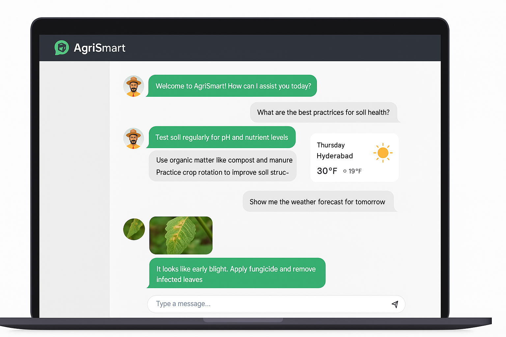
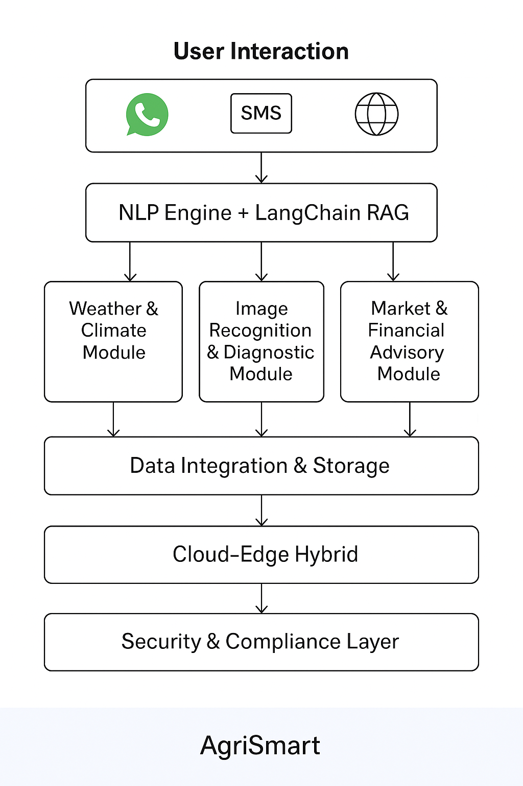

# AgriSmart

AgriSmart is an open‑source AI advisory platform designed to empower India's smallholder farmers. By leveraging Meta's LLaMA models, AgriSmart provides real‑time, localized agricultural insights through a multilingual chatbot interface. The project aims to address key challenges such as crop management, weather forecasting, crop disease diagnostics, and market connectivity, all via a user‑friendly digital interface.

## Overview 

AgriSmart is a modular, cloud‑edge hybrid architecture consisting of the following layers:

- **User Interaction Layer:**  
  - Channels: WhatsApp chatbot, SMS, and a responsive web dashboard.
  - Features: Intuitive, multilingual interface accessible even for users with limited digital literacy.

- **NLP & Chatbot Engine:**  
  - Powered by Meta’s LLaMA models fine‑tuned for agricultural language.
  - Built using the LangChain framework with a retrieval‑augmented generation (RAG) pipeline to deliver context‑rich, accurate advice.

- **Weather & Climate Module:**  
  - Integrates real‑time meteorological APIs, satellite imagery, and historical weather data.
  - Provides localized forecasts and seasonal trend analysis for optimized agricultural planning.

- **Image Recognition & Diagnostic Module:**  
  - Uses deep learning models trained on crop disease datasets.
  - Analyzes images captured via mobile devices to detect diseases early and recommend remedial actions.

- **Market & Financial Advisory Module:**  
  - Aggregates real‑time market pricing data and connects farmers directly with buyers.
  - Suggests tailored financial products, credit options, and government schemes based on individual farm profiles.

- **Data Integration & Storage:**  
  - Employs a cloud‑edge hybrid system to manage intensive computations in the cloud while enabling low‑latency processing locally.
  - Aggregates diverse data sources into scalable vector stores and databases.

- **Security & Compliance:**  
  - Implements robust encryption and privacy controls.
  - Utilizes safety mechanisms inspired by LLaMA Guard to filter outputs and ensure responsible use.

## Contact

For any inquiries or contributions, please reach out to:  
[rulercosta.mail@gmail.com](mailto:rulercosta.mail@gmail.com)

GitHub: [rulercosta](https://github.com/rulercosta)

License: [LICENSE](LICENSE)

---

*This repository is maintained as a proposed solution concept for Hack2Skill and Meta's Hackathon. Contributions and discussions are welcome.*
